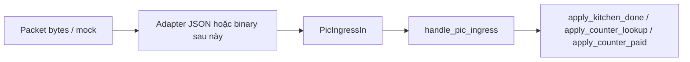

# PIC / NRF ingress — Pi backend (A05.2 + A06)

**Mục đích:** một điểm vào **duy nhất** cho lệnh từ PIC (sau khi giải mã gói RF hoặc mock), gọi thẳng các hàm domain hiện có trong `pic_commands.py` — **không** nhân đôi nghiệp vụ với route HTTP dev.

**Nguồn sự thật:** mã `app/services/pic_ingress/` + `pic_commands.py`; **giao thức binary** `docs/architecture/pi-pic-protocol.md`; HTTP `POST /api/v1/dev/...` (khi `PI_DEBUG=1`) chỉ là **mặt nạ** gọi `handle_pic_ingress`.

## Luồng xử lý



## Cấu trúc thư mục (pi-backend)

| File | Vai trò |
|------|---------|
| `app/services/pic_ingress/types.py` | `PicIngressCommand`, `PicIngressIn` |
| `app/services/pic_ingress/service.py` | `handle_pic_ingress` — resolve bàn (kitchen) + delegate `apply_*` |
| `app/services/pic_ingress/nrf_json.py` | `decode_pic_command_json` — mock / lab (UTF-8 JSON) |
| `app/services/pic_ingress/nrf_binary.py` | `decode_pic_command_binary` — frame 32 byte `v1` → `PicIngressIn` |
| `app/services/pic_ingress/worker.py` | `handle_nrf_ingress_frame`, `run_ingress_loop` (SPI/queue inject) |
| `app/api/v1/dev.py` | HTTP dev → `PicIngressIn` + `handle_pic_ingress` |

## Payload tối thiểu (sau parse)

- **`command`:** một trong `CMD_KITCHEN_DONE` | `CMD_COUNTER_LOOKUP` | `CMD_COUNTER_PAID` (chuỗi khớp decision-log / giao thức).
- **`table_code`:** số nguyên dương = `dining_table.code` (QR / D-17).

### JSON mock (UTF-8)

Dùng cho bridge script, test bench, socat:

```json
{"cmd": "CMD_KITCHEN_DONE", "table_code": 6}
```

Alias được hỗ trợ:

- `command` thay cho `cmd`
- `table_id` thay cho `table_code` (cùng nghĩa mã bàn)

Lỗi parse → `PicIngressDecodeError`.

## Hành vi lỗi / chuyển trạng thái

- **Kitchen:** bàn không tồn tại → `ack: false`, `err: TABLE_NOT_FOUND`; không có `active_order_id` → `NO_ACTIVE_ORDER`; còn lại do `apply_kitchen_done` (idempotent nếu đơn không còn `IN_KITCHEN`).
- **Counter paid:** `PAYMENT_NOT_REQUESTED`, `NOT_FOUND`, idempotent khi đã `PAID` — như `apply_counter_paid`.
- **Lookup:** read-only — như `apply_counter_lookup`.

Chi tiết HTTP mapping (mã 404/400) chỉ thuộc `dev.py`, không nằm trong ingress.

## Kiểm thử

- `tests/test_pic_ingress.py` — decode JSON, map lệnh, chuyển trạng thái không hợp lệ (`PAYMENT_NOT_REQUESTED`, `NO_ACTIVE_ORDER`, …).
- `tests/test_nrf_binary.py` — decode binary + `handle_nrf_ingress_frame`.
- Checklist tích hợp: `docs/planning/A06-test-checklist.md`.
